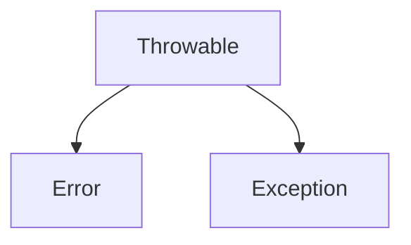

# Excepciones
Son eventos que ocurren durante la ejecucion del programa que interrumpen el flujo normal de las instrucciones.

En Java, una excepción es un objeto que envuelve un evento de error que ocurre dentro de un método, contiene:

+ Información sobre el error ocurrido.
+ El estado del programa cuando ocurrio el error.
+ Opcionalmente, otra información personalizada.

La super clase es Throwable



Se ejecuta el bloque *try* hasta que se produzca una excepción de tipo *exception* el texto debería continua aqui

```java
try {
	// codigo que puede causar una excepción
} catch (TipoExcepcion) {
	// codigo que trata la excepción
} finally {
	// codigo que se ejecuta en cualquier caso
}
```

## Propagación
Puede ser que no nos interese tratarlas en ese método, entonces lo que se hace es propagarlas al método de llamada para que las trate. Para ello usamos la palabra *throw objeto tipoExcepción*.

```java
if (denominador == 0) {
	throw new ArthmeticException("El denominador no puede ser cero.");
}
```


```java
// clase principal
Division division = new Division(...);

try {
	division.dividir(..., ...);
} catch {
	System.out.println("Error" + e.getMessage());
}

// clase Division
...dividir() throws ArithmeticException;

if (denominador == 0) {
	throw new ArthmeticException;
	System.out.println(...);
}
```

## Definir excepciones
Las excepciones predefinidas por Java cubren las situaciones de errores más habituales relacionadas con el propio lenguaje, pero cuando desenvolvemos aplicaciones se dan situaciones de error relacionadas con nuestro programa, por lo que hay que definir excepciones personalizadas.

```java
public class NuevaExcepcion extends Exception {
	public NuevaExcepcion() {
		super();
	}
	
	public NuevaExcepcion(String mensaje) {
		super(mensaje);
	}
}
```