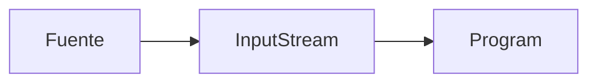
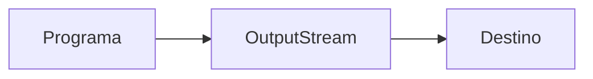

# IO
Es una API (`java.io`) que nos permite leer y escribir datos.

Contiene diversas subclases, cada una con distintos propositos, entre ellos:

- Acceso a archivos
- Acceso a la red
- Acceso al buffer de memoria interna
- Comunicación entre hilos
- Buffering
- Filtrado
- Interpretado/Analizado
- Leer y escribir texto
- Leer y escribir datos primitivos
- Leer y escribir objetos

## Procedimiento
### Lectura

1. Se abre el flujo **desde** el archivo 
2. Se lee el contenido
3. Se cierra el flujo



### Escritura

1. Se abre el flujo **hacia** el archivo
2. Se escriben los datos
3. Se cierra el flujo



## Ejemplos
```java
	import java.io.File;
	
	public class EjemploLectura() {
		public static main(String[] args) {
			File file = new File(ruta);
			
			
		}
	}
```
